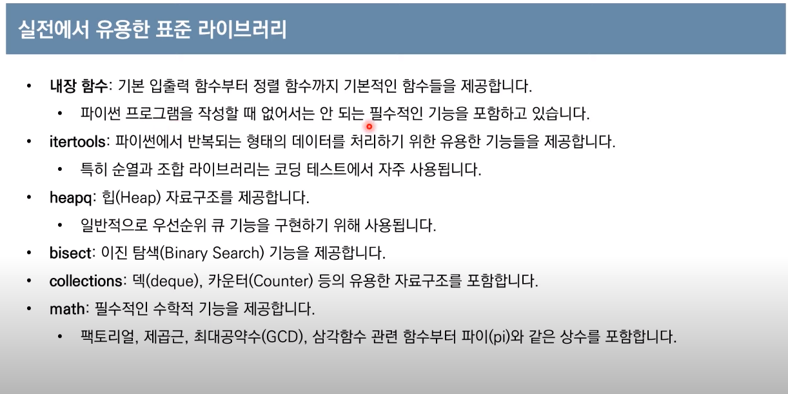

# Python_개념

### 1. 특정 문자로 구분지어 입력 받기

```python
year, month, day = input().split('.')
# 2015.3.23 이라 입력 하게 되면 . 으로 구분지어 차례로 입력 받음
```


### 2. 숫자에서 빈 자리수 0으로 채우기

```python
month.zfill(2)
# 1번 예제에서 month에 3을 입력 받았지만 zfill 을 이용하면 03 으로 앞의 빈 칸을 0으로 채운다.
```


### 3. 반올림 round(a,b)

round(a,b) 를 통해 a라는 수를 소수점 b 번째 자리까지 표현할 수 있다.

```python
x = round(123.456, 2)
print(x)

소수점 3 번째에서 반올림 하게 되면 123.46이 나오게 된다.
>> 123.46
```


### 4. List slicing

콜론(:) 을 이용해 리스트를 슬라이싱 할 수 있다.

이 때, 마지막 인덱스 숫자보다 1을 크게 한다.(마지막 인덱스는 포함x)

- 시작 인덱스가 없을 경우 처음부터

- 마지막 인덱스가 없을 경우 끝까지
- [a​ : b : ​x] : a번부터 b-1 까지 x개씩 띄워서 나타낸다.

```python
arr = [0,4,2,7,1,9,6,3,8,5]
#	   0,1,2,3,4,5,6,7,8,9

print(arr[3:7])
>> [7,1,9,6]

print(arr[:4])
>> [0,4,2,7]

print(arr[1:8:2])
>> [4, 7, 9, 3]

```


### 5. List Comprehension

대괄호([]) 안에 조건문과 반복문을 주어 리스트를 초기화 할 수 있다.

특히 2차원 배열을 초기화 할 때 유용하게 쓰일 수 있다.

```python
arr = [i for i in range(10)]
print(arr)

>> [0,1,2,3,4,5,6,7,8,9]

arr = [i for i in range(20) if i % 2 ]
print(arr)

>> [1,3,5,7,9,11,13,15,17,19]

n,m = 4, 6
arr = [[0]*n for _ in range(m)]

>> 이런 식으로 활용 가능 !
```


### 6. List 관련 Method

#### 6.1 sort()

- 오름차순 정렬
- 내림차순 정렬은 arr.sort(reverse=True)


```python
a = [1, 4, 3, 2]
a.sort()
print(a)
[1, 2, 3, 4]
```


#### 		6.2 reverse()

​			- 배열을 거울에 mirroring 하듯 뒤집는다.

```python
arr = [1,8,5,2,4]
arr.reverse()
print(arr)

>> [4,2,5,8,1]
```


#### 		6.3 index()

​			- index(x) 함수는 리스트에 x 값이 있으면 x의 위치 값을 돌려준다.

```python
arr = [1,5,9,7,2]
x = arr.index(5)
print(x)

>>> 1
```


#### 		6.4 insert(a,b)

​			- arr.insert(a,b) : `a` 자리에 `b` 를 넣기

```python
x = [1,5,7]
x.insert(1,2)
print(x)

>>> [1, 2, 5, 7]
```


#### 		6.5 remove(a)

​		- `arr.remove(a)` 형태로 쓰며 a 값을 찾아 삭제해 준다. 이 때, arr 안에 a라는 값이 여러 개일 경우 첫 번째 		   값만 삭제해준다.

```python
arr = [1,2,3,1]
arr.remove(1)
print(arr)

>> [2, 3, 1]
```


#### 		6.6 count()

​		- `arr.count(x)` : arr 의 리스트 안에 x라는 값이 몇 개 존재하는지 count 해주는 메서드

```python
arr = [1, 2, 3, 1, 4, 1]
print(arr.count(1))

>>> 3
```


### 7. 사전형 자료(dictionary)

- key, value 형태로 존재하며, 한번 설정된 값은 변경 불가(immutable)

- 시간복잡도 측면에서 O(1) 이므로 상당한 이득이다.
- `data.keys()` or `data.values()` or `data.items()` 를 이용하여 for 문으로 사용할 때 유용하다. (리스트는 아님)
- `list(daya.keys())` or `list(data.values())` 를 이용하면 리스트로 만들어서 활용 가능
- `data[key]` == `data.get(key)` , 즉 get 을 통해 값을 얻을 수 있다.

```python
# dict() 를 이용하여 선언 ! or data = {'사과': 'apple', .....}  이런 식으로 선언 가능
data = dict()
data['사과'] = 'apple'
data['바나나'] = 'banana'
data['코코넛'] = 'Coconut'

print(data)

>> {'사과': 'apple', '바나나': 'banana', '코코넛': 'Coconut'}

for key in data.keys():
    print(key)


```


### 8. 집합 자료형 set()

#### 8.1 집합 자료형 선언

- `s1 = set()` 으로 빈 집합 선언 or `s1 = set([1,2,3])`

- `s1 = {1,2,3,4}` 이런 식으로도 선언 가능
- `s1.add(5)` 로 특정 값을 추가, 만약 원소 여러개 추가하고 싶으면 `s1.update([5,6])` update 사용!
- `s1.remove(5)` 처럼 remove 를 제거하여 특정 값 제거 가능

```python
s1 = set()
s1 = set([1,2,3,4,1,2])
print(s1)

>> {1,2,3,4}

s1 = {1,2,3,4,5,1,2}
print(s1)
>> {1,2,3,4,5}

s2 = set("Hello")
print(s2)
>> {'e', 'H', ''}
```


#### 8.2 집합 자료형의 특징

	1. 리스트나 튜플과 다르게 `순서`가 없기 때문에 인덱싱을 이용하여 값을 얻을 수 없다.(element 사용함)
 2. 시간 복잡도는 O(1) 이므로 상당한 이득이 있다 마치 딕셔너리처럼
 3. 중복 허용하지 않는다 and 순서가 없다.
 4. 집합연산(교집합, 합집합, 차집합) 을 유용하게 사용하면 이득이다 !


#### 	8.3 집합연산

 1. ##### 교집합(intersection)

    - `&` 기호  혹은 `intersection()` 함수를 이용한다.

	2. ##### 합집합(union)

    - `|` 기호 혹은 `union`을 이용하여 나타낸다.
    - 중복된 것은 한번만 나타낸다.

	3. ##### 차집합(difference)

    - `-` 기호나 `difference`를 이용하여 나타낸다.

4. ##### 리스트로 사용하기

   - 인덱스를 사용할 수 없으므로 리스트형으로 변환하여 사용한다.
   - `l1 = list(s1)` 형태로 이용하면 인덱스 이용하기 가능


```python
s1 = set([1,2,3,4,5,6])
s2 = set([4,5,6,7,8,9])

# 교집합
print(s1 & s2)
print(s1.intersection(s2))
>>> {4,5,6}

# 합집합
print(s1 | s2)
print(s1.unoin(s2))
>>> {1,2,3,4,5,6,7,8,9}

# 차집합
print(s1 - s2)
print(s1.difference(s2))
>>> {1, 2, 3}

# 리스트로 형변환
l1 = list(s1)
print(l1)
>>> [1,2,3,4,5,6]
```


### 9. 공간과 변수(copy)

```python
a = [1,2,3]
b = a

print(a is b)
>>> True
```

라고 선언하게 되면 a,b 의 id 값은 같으므로 a값이 변경되면 b의 값도 똑같이 변경된다. 


따라서 이를 방지하기 위해 copy 2가지 방식을 알아볼 것이다.

#### 9.1 **콜론(:)**

콜론을 이용하여 리스트 전체를 복사할 수 있다.

```python
a = [1,2,3]
b = a[:]
a[1] = 4

print(a)
>>>[1,4,3]

print(b)
>>> [1,2,3]
```


#### 9.2 **copy 모듈 이용**

여기서는 import 를 사용해 copy 모듈을 가져올 것이다.

```python
from copy import copy

a = [1,2,3]
b = copy(a)

print(a is b)
>>> False
```


### 10. 함수 & lambda 표현식

#### 	10.1 입력 값의 개수를 모를 때

```python
def add_many(*args):
    result = 0
    for i in args:
        result += i
    return result

print(add_many(1,2,3))
>>> 6

# ㅡㅡㅡㅡㅡㅡㅡㅡㅡㅡㅡㅡㅡㅡㅡㅡㅡㅡㅡㅡㅡㅡㅡㅡㅡㅡㅡㅡㅡㅡㅡㅡㅡㅡㅡㅡㅡㅡㅡㅡㅡㅡㅡㅡㅡㅡㅡㅡ
def add_mul(choice, *args): 
    if choice == "add": 
        result = 0 
        for i in args: 
            result = result + i 
    elif choice == "mul": 
        result = 1 
        for i in args: 
            result = result * i 
    return result
```

​	매개변수로 꼭 `*args` 하나만 올 수 있는 것은 아니다. `def_cal(choice, *args)` 처럼 도 사용 가능


※ **키워드 파라미터 kwargs**

이번에는 키워드 파라미터에 대해 알아보자. 키워드 파라미터를 사용할 때는 매개변수 앞에 별 두 개(`**`)를 붙인다. 역시 이것도 예제로 알아보자. 먼저 다음과 같은 함수를 작성한다.

```python
>>> def print_kwargs(**kwargs):
...     print(kwargs)
...
```

print_kwargs 함수는 매개변수 kwargs를 출력하는 함수이다. 이제 이 함수를 다음과 같이 사용해 보자.

```python
>>> print_kwargs(a=1)
{'a': 1}
>>> print_kwargs(name='foo', age=3)
{'age': 3, 'name': 'foo'}
```

입력값 `a=1` 또는 `name='foo', age=3`이 모두 딕셔너리로 만들어져서 출력된다는 것을 확인할 수 있다. 즉 `**kwargs`처럼 매개변수 이름 앞에 `**`을 붙이면 매개변수 kwargs는 딕셔너리가 되고 모든 `key=value` 형태의 결괏값이 그 딕셔너리에 저장된다.

> ※ 여기에서 kwargs는 keyword arguments의 약자이며 args와 마찬가지로 관례적으로 사용한다.


#### 10.2 lambda 함수

lambda 안에 def 라는 의미가 들어가 있으며 함수의 이름을 굳이 줄 필요가 없이 간단한 함수를 정의할 때 쓰인다.


> lambda 매개변수1, 매개변수2, ... : 매개변수를 이용한 표현식

```python
add = lambda a,b : a+b
result = add(3,4)
print(result)

>>> 7
# 위, 아래의 함수는 완전히 동일하다.

def add(a,b):
    return a+b


```


sorted 와 함께 정렬을 하면 더욱 유용하다.

```python
a = [(1,2), (0,1), (5,1), (5,2), (3,0)]

# 튜플의 첫 번째 값을 기준으로 정렬한다.
b = sorted(a, key=lambda x:x[0])

# 첫 번째 인자를 기준으로 오름차순 정렬하고 그리고 그 안에서 다음 두 번째 인자를 내림차순 정렬
c = sorted(a, key = lambda x : x[0], -x[1])

# sort와 lambda를 이용해서도 이렇게 정렬 가능하다.
a.sort(key=lambda x : (x[0], x[1]))
>>> [(0, 1), (1, 2), (3, 0), (5, 1), (5, 2)]
```


### 11. 실전에서 유용한 표준 라이브러리





> ### sorted()

- 기존의 리스트를 변경하는 것이 아니라 정렬의 새로운 리스트를 반환
- 어떤 이터러블 객체도 받을 수 있다
  (ex 딕셔너리 객체도 받을 수 있음)
- 오름차순 정렬 : sorted()
- 내림차순 정렬 : sorted(reverse=True)

```python
# 오름차순 정렬
result = sorted([9,1,8,5,4])
# 내림차순 정렬
reverse_result = sorted([9,1,8,5,4], reverse = True)
print(result)
print(reverse_result)
>>> [1, 4, 5, 8, 9]
>>> [9, 8, 5, 4, 1]

# sorted with key
# sorted(이터러블, key, 정렬옵션) 형태로 쓴다. 여기서 정렬옵션 대신 -x[1] 로 써도 괜춘 !!

array = [('홍길동', 35), ('이순신', 70), ('강감찬', 60)]
result = sorted(array, key = lambda x : x[1], reverse = True)
print(result)
>>> [('이순신', 70), ('강감찬', 60), ('홍길동', 35)]
```


> ### 순열과 조합


```python
from itertools import permutations, combinations, product, combinations_with_replacement

data = ['A', 'B', 'C']

# 순열
per_result = list(permutations(data, 3))
print(per_result)
>>> [('A', 'B', 'C'), ('A', 'C', 'B'), ('B', 'A', 'C'), ('B', 'C', 'A'), ('C', 'A', 'B'), ('C', 'B', 'A')]

# 조합
c_result = list(combinations(data, 2))
print(c_result)
>>> [('A', 'B'), ('A', 'C'), ('B', 'C')]

# 중복순열
pro_result = list(product(data, repeat = 2))
print(pro_result)
>>> [('A', 'A'), ('A', 'B'), ('A', 'C'), ('B', 'A'), ('B', 'B'), ('B', 'C'), ('C', 'A'), ('C', 'B'), ('C', 'C')]

# 중복조합
com_result = list(combinations_with_replacement(data, 2))
print(com_result)
>>> [('A', 'A'), ('A', 'B'), ('A', 'C'), ('B', 'B'), ('B', 'C'), ('C', 'C')]
```


> ### Counter

리스트와 같은 반복가능한(iterable) 객체가 주어졌을 때, 내부의 원소가 몇 번 등장했는지 count 해준다.

```python
from collections import Counter

# Counter로 선언 !
counter = Counter(['red', 'green', 'red', 'blue', 'red', 'blue', 'red'])

print(counter['blue'])
>>> 2

print(counter['red'])
>>> 4

print(dict(counter))
>>> {'red': 4, 'green': 1, 'blue': 2}
```


6. deque

- deque를 이용해 stack, queue 모두 이용 가능하다

  1. Stack 구현

     - stack 은 나중에 들어간게 먼저 나오는 형태 따라서 `append`, `pop`을 이용하여 오른쪽을 +, - 할 수 있다.

     ```python
     from collections import deque
     arr = deque(list(range(1,7)))
     arr.append(7)
     >>> [1,2,3,4,5,6,7]
     
     arr.pop()
     >>> 7
     ```


  1. Queue 구현

     - Queue는 first in - first out 이므로 `appendleft()` - `pop()` 혹은 `append()` - `popleft()` 를 이용할 수 있다.

     ```python
     from collections import deque
     arr = deque(list(range(1,7)))
     
     arr.appendleft(0)
     print(arr)
     >>> [0,1,2,3,4,5,6]
     
     arr.pop()
     >>> 6
     
     ```

     

4. input() 대신 sys.stdin.readline() 을 써서 시간을 줄이자

- 하지만 sys.stdin.readline() 을 쓰게 되면 뒤에 개행문자 \n 도 같이 나오게 되므로 `strip` 사용 !

```python
import sys
x = sys.stdin.readline()
x 에 123 입력하면
>>> '123\n' 이 입력됨

따라서 
sys.stdin.readline().strip() 을 이용하여 맨 뒤 개행문자를 자동 삭제

```

- 만약 input을 `123 456` 처럼 띄워서 받고 싶다면 `x = sys.stdin.readline().split()` 으로 받으면 된다.


# 알고리즘 _ 개념 

## 1. Greedy 알고리즘

- 탐욕 알고리즘이라고도 불리며 현재 상황에서 당장 좋은 것만 고르는 방법
- 그리디의 해법은 정당성 분석이 중요 > 단순하게 가장 좋아 보이는 것을 고르는 것만으로도 정답이 될 수 있는지 확인하기 !!